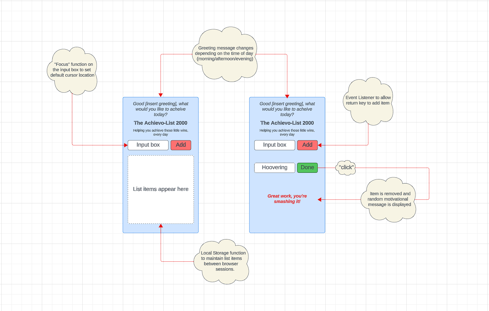
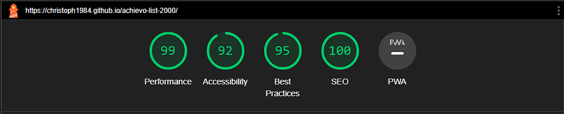

# The Achievo-List 2000

Welcome to "The Achievo-List 2000" - a dynamic to-do list application designed to streamline your task management and boost productivity with a user-friendly and motivational interface. Ideal for organizing daily chores, work tasks, and personal goals.

## Key Features

- **Task Management:** Add, view, and manage your tasks with ease. The intuitive input field and "Add" button make entering tasks effortless.
- **Real-Time Updates:** The task list updates in real time, allowing you to see your progress and stay organized.
- **Motivational Messages:** Get inspired with motivational messages that appear to encourage you as you complete tasks.
- **Responsive Design:** Enjoy a seamless experience across all devices, thanks to the application's responsive web design.
- **User-Friendly Interface:** Experience a clean, minimalistic interface designed for ease of use and efficiency.
- **Interactive Elements:** Engaging buttons and interactive elements enhance user experience and make task management more enjoyable.

## Getting Started

Visit [The Achievo-List 2000](https://christoph1984.github.io/achievo-list-2000/) and get a handle on your tasks in a fun and effective way!

### Adding a Task

- Type your task into the "Put jobs here" field.
- Click "Add" to append your task to the list, where it's displayed prominently.

### Viewing and Managing Tasks

- Tasks are listed clearly below the input field.
- Interact with your list to track and manage your daily goals.

## User Experience Highlights

- **Simplicity:** The application is built with a focus on simplicity, making it accessible for users of all ages and tech-savviness.
- **Engagement:** Interactive elements like buttons and motivational messages create a more engaging experience.
- **Accessibility:** Designed with accessibility in mind, ensuring it's usable by everyone.

## Design 

### Wireframes from Lucid

## Version Control
<ul>
<li>The website was developed through Codeanywhere IDE.</li>
<li>Code has been pushed to repository on Github with following git commands:</li>
  <ul>
  <li>git add . - to add files ready to commit</li>
  <li>git commit -m "message" - to commit the code to local repository ready to be pushed</li>
  <li>git push - final command used to push committed code to remote repo on Github</li>
  </ul> 
</ul>

## Testing

* Browser Compatibility

| Browser | Test | Result  |
--- | --- | ---
Google Chrome | No issues.| Pass
Safari | No issues. | Pass
Mozilla Firefox | No issues.| Pass
Microsoft Edge | No issues. | Pass

* Device Compatibility

| Device | Test | Result  |
--- | --- | ---
Google Pixel 6 Pro | No issues.| Pass
iPhone SE| No issues. | Pass
iPhone 13 | No issues.| Pass

* Greeting message time of day testing

| Time of Day | Result  |
--- | --- 
Morning | Pass 
Afternoon | Pass
Evening | Pass

* Lighthouse testing (site tested in Lighthouse repeatedly throughout development)

### Cloning the Repository
<ul>
<li>Navigate to the GitHub Repository 'christoph1984/achievo-list-2000'</li>
<li>Click 'Code' drop down menu - a green button shown right above the file list.</li>
<li>Copy the URL of the repository using 'HTTPS', 'SSH'or 'Github CLI'.</li>
<li>Open Git Bash.</li>
<li>Change the current working directory to the location where you want the cloned directory.</li>
<li>Type 'git clone', and then paste the URL copied earlier.</li>
<li>Press enter to create local clone. A clone of the repository will now be created.</li>
<li>For more details on how to clone the repository in order to create a copy for own use refer to the site: https://docs.github.com/en/repositories/creating-and-managing-repositories/cloning-a-repository.</li>
</ul>

### Forking
<ul>
<li>Navigate to the GitHub Repository 'christoph1984/achievo-list-2000’</li>
<li>Click 'Fork' located towards top right corner on GitHub page.</li>
<li>Select 'owner' for the forked repository from the dropdown menu under 'owner'.</li>
<li>It will create forked repo under the same name as original by default. But you can type a name in 'Repository name' or add a description in 'Description' box.</li>
<li>Click on 'Create fork'. A forked repo is created.</li>
<li>Forking enables you to implement modifications without impacting the original project. You can propose changes by submitting a pull request. Subsequently, the Project Owner can evaluate the pull request, decide whether to accept the proposed changes, and merge them.</li>
<li>When you have fork to a repository, you don't have access to files locally on your device, for getting access you will need to clone the forked repository.</li>
</ul>

### Deployment
<ul>
<li>Go to GitHub repository.</li>
<li>Click on 'Settings'.</li>
<li>Click on 'Pages'(tab on the left sidebar).</li>
<li>Scroll to 'Build and deployment'/'Source' section.</li>
<li>Find the sub-section 'Branch'.</li>
<li>From the drop-down menu 'none'/'select branch' and choose source 'main' (or 'master').</li>
<li>Click 'Save'</li>
<li>Wait until you can see a link for deployed page within GitHub Page section. This can take a while. Once the page updates you will see a message: Your site is live at https://christoph1984.github.io/achievo-list-2000/</li>
</ul>

## Technologies
* HTML - used to create the main structure of the website.
* CSS - used to style the website.
* Javascript - used to create the interactive functions
* Codeanywhere built-in formatter to format structure for HTML, CSS & JS files in the project.
* Codeanywhere IDE to develop the website.
* GitHub to host the source code and GitHub Pages to deploy and host the live site.
* Git to provide the version control to commit and push code to the repository.
* Google Fonts for typography.
* FontAwesome v5.15.4 for icons.
* Google Chrome Dev Tools for inspecting, debugging pages and testing layouts.
* Pexels - used to source the images for the website.
* Favicon.io to create the website favicon.
* Am I Responsive to create the Mockup image in this README.
* Google Chrome's Lighthouse to test accessibility for desktop and mobile devices.
* W3C HTML Markup Validator to validate the HTML Code.
* W3C Jigsaw CSS Validator to validate the CSS Code.
* JSHINT validator to validate the JS code
* Code Institute's Codeanywhere Template to generate the workspace for the project.

## Credits
* Google Fonts - for fonts to use in website.
* FontAwesome for all the icons used in the website.
* W3Schools.com - used throughout the website for general help.
* Stack Overload - used throughout the website for general help.
* Google
* Lucid - for wireframe design
* The favicon.ico image for the website.
* freeCodeCamp.org for general guidance and examples

## Contact

Reach out to Christoph1984 for queries or feedback on [Github](https://github.com/christoph1984).

Get organized and stay motivated with "The Achievo-List 2000"!
